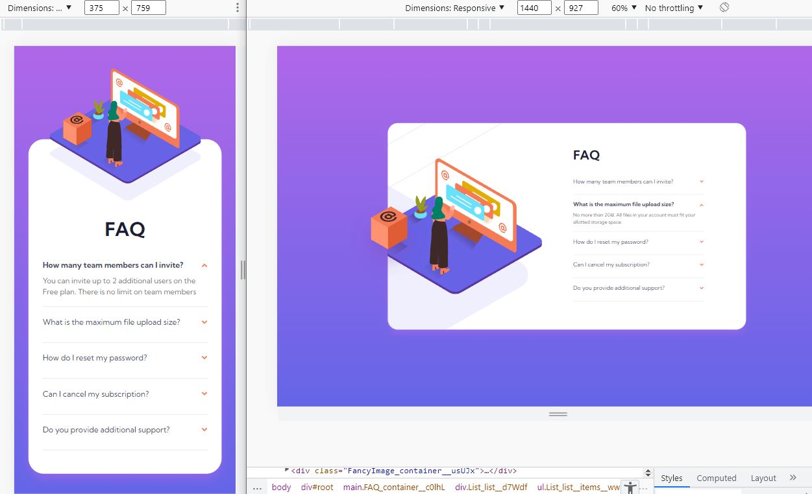

# Frontend Mentor - FAQ accordion card solution

This is a solution to the [FAQ accordion card challenge on Frontend Mentor](https://www.frontendmentor.io/challenges/faq-accordion-card-XlyjD0Oam).

## Table of contents

- [Overview](#overview)
  - [The challenge](#the-challenge)
  - [Screenshot](#screenshot)
  - [Links](#links)
- [My process](#my-process)
  - [Workflow](#workflow)
  - [Built with](#built-with)
  - [What I learned](#what-i-learned)
  - [Continued development](#continued-development)
  - [Useful resources](#useful-resources)
- [Author](#author)
- [Acknowledgments](#acknowledgments)

## Overview

### The challenge

Users should be able to:

- View the optimal layout for the component depending on their device's screen size
- See hover states for all interactive elements on the page
- Hide/Show the answer to a question when the question is clicked

### Screenshot

### Links

- Solution: [frontendmentor.io](https://your-solution-url.com)
- Live Site: [netlify.app](https://your-live-site-url.com)

## My process

### Workflow

- Preparing workflow (Installing Reactjs, Adding assets, Preparing README.md)

- Identifying components
  - FAQ, FancyImage, List, Item

- Adding CSS Preflight

- Creating components

- Working on mobile design based on `design` folder

- Working on desktop design based on `design` folder

- Working on React functionality for accordion faq

- Completing README.md

- Publish on Github.com | netligy.app | frontendmentor.io

### Built with

- [React](https://reactjs.org/)
- [CSS Module](https://create-react-app.dev/docs/adding-a-css-modules-stylesheet) - For styles
- Mobile-first workflow
- Semantic HTML5 markup
- CSS custom properties
- Flexbox
- Grid

### What I learned

Image position and smooth toggling was the tricky part of this challenge. Finally I've solved this challenge by using useRef, useState, and useEffect 
to achieve smooth animation on toggling description section

### Continued development

Reading and using animation libraries in my upcoming solution

### Useful resources

- [5 ways to animte a React app](https://medium.com/hackernoon/5-ways-to-animate-a-reactjs-app-in-2019-56eb9af6e3bf)

## Author

- Frontend Mentor - [@siavhnz](https://www.frontendmentor.io/profile/siavhnz)

- Gihtub - [siavhnz](https://github.com/siavhnz)

- Codepen - [@siavhnz](https://codepen.io/siavhnz)

## Acknowledgments

Thanks To

[Frontendmentor.io](https://www.frontendmentor.io/challenges) - for their Excitement challenges  

[Perfect Pixel](https://chrome.google.com/webstore/detail/perfectpixel-by-welldonec/dkaagdgjmgdmbnecmcefdhjekcoceebi?hl=en) - for such a great extension

